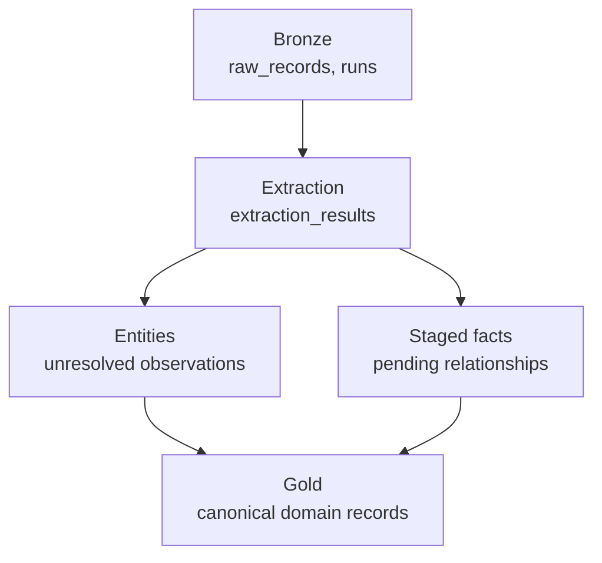

# Ingestion Pipeline Architecture

How data moves from a source (a scrape, an RSS feed, a manual submission)
into the domain model described in
[`domain-schema-v2.md`](./domain-schema-v2.md). This doc covers the pipeline
layers, the jobs that move data between them, and the operational rules
(idempotency, incrementality, retries) that keep the pipeline correct at
scale. Table DDL for the domain layer (`people`, `titles`, `companies`,
`credits`, etc.) lives in `domain-schema-v2.md`; this doc only defines the
pipeline tables that don't belong there.

## Principles

- **Bronze → silver → gold.** Each layer is independently replayable. Fix a
  bug in extraction, rerun bronze→silver without re-fetching sources. Fix a
  bug in resolution, rerun silver→gold without re-extracting.
- **Idempotent jobs.** Rerunning any job with the same inputs produces the
  same outputs. This is what makes replay safe instead of a manual cleanup
  exercise.
- **Derived state is recomputable, decision logs are not.** Anything that's
  the *output* of a computation (`entities.canonical_id`, a materialized
  `credits` row) can be dropped and rebuilt from the log that produced it.
  Anything that's a *fact about a decision made* (`entity_match_decisions`,
  `source_facts`) is append-only and never rewritten.
- **Incremental, not full-scan.** Every job processes rows changed since a
  watermark, not the whole table, every run.

## Layer 1 — Bronze: raw ingestion

**Tables:** `runs`, `raw_records` (unchanged from the current schema).

Exactly what was fetched, content-addressed by hash, append-only, never
mutated. The point of bronze is that nothing downstream ever needs to go
back to the source — sources rate-limit, pages disappear, APIs change.

## Layer 2 — Bronze → Silver: extraction

**Table:** `extraction_results` (unchanged).

Parser/LLM output tagged with `schema_version` / `prompt_version` /
`model_name`. Multiple extraction attempts per `raw_record` are expected and
kept side by side — improving a prompt means rerunning extraction and
comparing, never overwriting a prior result.

Extraction produces two kinds of output, landing in two different staging
tables:
- **Entity mentions** (a person, title, or company named in the document) →
  `entities`.
- **Relationship mentions** (a credit, a deal, a rep relationship) →
  `staged_facts`.

## Layer 3 — Silver: entities (conformed, unresolved)

```sql
CREATE TABLE entities (
    id              TEXT PRIMARY KEY,          -- stable SHA-256 hash
    source_id       TEXT NOT NULL,
    external_id     TEXT,
    entity_type     TEXT NOT NULL,              -- person, title, company
    name            TEXT NOT NULL,
    canonical_name  TEXT NOT NULL,              -- casefolded, used for blocking
    bio             TEXT,
    position        TEXT,
    title_type      TEXT,
    format          TEXT,
    company_type    TEXT,
    status          TEXT NOT NULL DEFAULT 'active',
    license_class   TEXT NOT NULL,
    metadata_json   TEXT NOT NULL DEFAULT '{}',
    canonical_id    TEXT,                       -- FK to people/titles/companies(id)
                                                -- by entity_type; null = unresolved
    created_at      TEXT NOT NULL,
    updated_at      TEXT NOT NULL
);
```

One row per source observation, never deduped in place. `canonical_id` is
null until the resolution job assigns it. Two `entities` rows from different
sources describing the same real person both end up with the same
`canonical_id` — that's what makes them "the same person" downstream.

## Layer 4 — Entity resolution

**Table:**

```sql
CREATE TABLE entity_match_decisions (
    id              TEXT PRIMARY KEY,
    entity_a_id     TEXT NOT NULL REFERENCES entities(id),
    entity_b_id     TEXT NOT NULL REFERENCES entities(id),
    entity_type     TEXT NOT NULL,
    decision        TEXT NOT NULL,              -- match, no_match, needs_review
    confidence      REAL,
    reason          TEXT NOT NULL,              -- blocking key / rule that surfaced this pair
    decided_by      TEXT NOT NULL,              -- 'system:<job>' or reviewer id
    decided_at      TEXT NOT NULL,
    created_at      TEXT NOT NULL
);
```

Append-only — a reviewer overturning a prior decision inserts a new row, it
never edits the old one. This is the audit trail.

**Why not resolve by walking pairs and repointing `canonical_id` directly?**
Because pairwise repoint-on-confirm chains: if A matches B (genuine) and B
matches C (a noisy false positive), naive pairwise merging puts A and C in
the same cluster even though nobody ever compared them. Production
entity-resolution systems (Splink, Senzing, Zingg, AWS Entity Resolution)
avoid this by treating resolution as **graph clustering**, not sequential
pairwise merging.

**The clustering job:**

1. Load all `decision='match'` rows for a given `entity_type` as edges over
   `entities` nodes.
2. Compute connected components (union-find). Cap cluster size or fall back
   to a stricter algorithm (correlation clustering) past a density threshold
   — an unusually large cluster is itself a signal that noisy matches are
   chaining unrelated entities together, and should be flagged for review
   rather than silently accepted.
3. For each cluster: reuse the existing `canonical_id` if any member already
   has one; otherwise create a new row in `people`/`titles`/`companies`.
4. Write `canonical_id` onto every `entities` row in the cluster, one
   transaction per cluster.

This job is idempotent and incremental: given the same decisions it always
produces the same clusters, and a normal run only recomputes components
touched by new or changed `entity_match_decisions` rows, not the whole
graph.

**Late merges.** If two golden records are discovered to be duplicates after
downstream data already references both: repoint every `entities` row's
`canonical_id` from the losing id to the surviving id, then mark the losing
`people`/`titles`/`companies` row `status='merged'` (tombstoned, not
deleted) so existing FKs from `credits`/`deals`/etc. still resolve until
those rows are backfilled to the surviving id.

## Layer 5 — Silver: staged relationship facts

```sql
CREATE TABLE staged_facts (
    id                   TEXT PRIMARY KEY,
    fact_type            TEXT NOT NULL,        -- credit, representation, deal,
                                                -- award, collaboration, submission
    entity_refs_json     TEXT NOT NULL,        -- {"person_id": "<entities.id>", ...}
    payload_json         TEXT NOT NULL,        -- fact-type-specific fields
    status               TEXT NOT NULL DEFAULT 'pending',
                                                -- pending, materialized, unresolvable
    materialized_table    TEXT,
    materialized_row_id   TEXT,
    source_id            TEXT NOT NULL,
    document_id           TEXT REFERENCES raw_records(id),
    extraction_id         TEXT REFERENCES extraction_results(id),
    trust_state           TEXT NOT NULL DEFAULT 'machine_extracted',
    created_at            TEXT NOT NULL,
    updated_at            TEXT NOT NULL
);
```

A credit extracted from a document names its person and title by their
`entities.id` — those might not have a `canonical_id` yet, or might resolve
in a later batch entirely. Writing directly to `credits` would require both
sides to already be golden, which isn't guaranteed at extraction time.
`staged_facts` holds the fact until it is.

**The materialization job:**

1. Select `staged_facts` where `status='pending'`.
2. Parse `entity_refs_json`; look up each referenced `entities.id` and check
   `canonical_id` is non-null on all of them.
3. If all resolved: build the corresponding gold row (per `fact_type`) using
   the resolved `canonical_id`s and `payload_json`, insert it, and set
   `status='materialized'`, `materialized_table`, `materialized_row_id`.
   The gold table's `source_fact_id` column is set to this `staged_facts.id`
   — it doubles as both the staging record and the provenance pointer.
4. If any reference is still unresolved: leave `status='pending'`, retried
   next run.
5. If a referenced entity was rejected during resolution (determined to be
   junk, not a real entity): mark `status='unresolvable'` — permanent, not
   retried.

Rerunning this job is a no-op for already-`materialized` rows — it only acts
on `pending`.

## Layer 6 — Gold: the domain model

`people`, `titles`, `companies`, and the join/identity tables — see
[`domain-schema-v2.md`](./domain-schema-v2.md) for full DDL. Every domain
table FKs only to other gold tables, never to `entities` or `staged_facts`
directly.

## Diagram



## Job model

| Job | Trigger | Idempotency | Incremental strategy |
|---|---|---|---|
| Ingest | scheduled poll / webhook | content-hash dedup on `raw_records` | cursor on source feed since last `fetched_at` |
| Extract | new `raw_records` row | `schema_version`+`prompt_version`+`model_name` as natural key — rerun-safe | watermark on rows not yet extracted at current `schema_version` |
| Resolve (cluster) | new/changed `entities` or `entity_match_decisions` rows | same decisions always produce the same clusters | recompute only the connected components touched by changed edges |
| Materialize | new/changed `staged_facts` or `entities.canonical_id` | no-op on already-`materialized` rows | scan `staged_facts` where `status='pending'` |

Each job owns its own failure/retry. A failed extraction doesn't block
ingesting the next raw record; a failed materialization doesn't block
resolution. Rows that fail repeatedly move to a dead-letter state after N
retries rather than blocking the batch.

## Data quality checks

- No `entities` row with a null `canonical_id` and no open
  `entity_match_decisions` older than N days — it's fallen out of the
  pipeline, not just pending review.
- No `staged_facts` row stuck in `pending` longer than N days without a
  corresponding unresolved `entities` row explaining why.
- No `entities.canonical_id` pointing at a `people`/`titles`/`companies` row
  that no longer exists (a tombstone that got hard-deleted instead of
  status-flagged).
- No gold join table row (`credits`, `deals`, etc.) whose FK doesn't resolve
  — this should be structurally impossible given real FKs, but worth an
  assertion during backfills.

## Metrics

- Unresolved `entities` count and age distribution.
- Pending `staged_facts` count and age distribution.
- Auto-merge vs. manual-review rate in `entity_match_decisions`.
- Average time from `entities` creation to `canonical_id` assignment.
- Cluster size distribution from the clustering job (a spike in large
  clusters is a signal of matching-rule drift).
